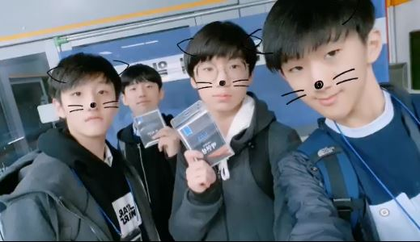
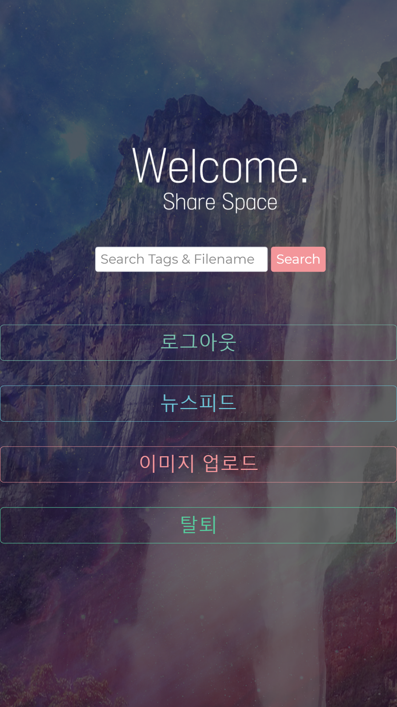

 # # 15th AppJam - ShareSpace (TTing-Shong)

## # Who are we?
> 15회 앱잼 신기술(VR) 분야에 나간 [**"띵숑 - We are TTing Shong"**](https://github.com/404-NOTFOUND)

 

> 개발자 : **여준호** (맨 우측) 
> 기획자 : **박현상** (우측에서 두 번째) 
> 인공지능 : **강준서** (맨 좌측) 
> 디자이너 : **손지민** (좌측에서 두 번째) 

- 개발자 여준호는 **파이썬을 사랑하는 변태이며 하바나를 좋아한다.**
- 프로토타이퍼 / 기획자 박현상은 **오디세이라는 엄청난 노트북을 가져와서 파격적으로 기획을 하였다.**
- AI 개발자 / 기획자 **강준서는 딥러닝이라는 엄청난 분야를 보여줬다.**
- 디자이너 손지민은 **분명 개발자인데 디자인을 더 많이한다.**

## # What did we make?
 
> - VR 컨텐츠를 누구나 업로드해 공유하고 이용할 수 있는 SNS(소셜 네트워크 서비스), ShareSpace

- ~~대체 [누구](http://github.com/JunhoYeo)의 아이디어이기에 이처럼 기발한지,,허허~^^7 

- 박현상이 실용적인 다기능 프로토타입을 설계했고, 강준서가 많은 부가기능을 기획했으나 개발자의 능력 부족으로 인해서 대회 때 제대로 구현하지 못해서 아쉬웠다.

## # How did we develop?

- Python의 Flask 프레임워크를 이용한 WebApp을 제작한 뒤 Android의 Web View 애플리케이션과 연동

- 웹앱의 데이터베이스 접근을 위해서 SQLAlchemy라는 툴킷을 이용함

- Tensorflow와 Inception-v3 모델을 이용한 AI를 사용해서 자동으로 컨텐츠에 맞는 태그를 다는 기능을 구현

## # What Program did we use?

- 디자인 : Adobe PhotoShop
- 프로토타이핑 : Oven
- 개발 : Atom, Android Studio
- 프리젠테이션 : Microsoft PowerPoint
